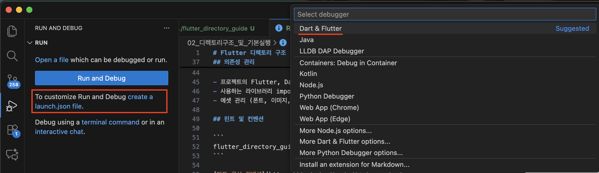
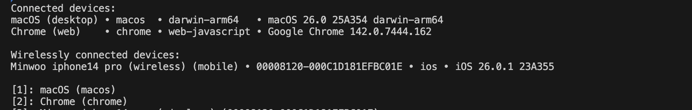

# Flutter 디렉토리 구조

## 프로젝트 시작지점

```bash
flutter_directory_guide/lib
```

lib 폴더 안에 있는 `main.dart`의

```dart
void main() {
  runApp(const MainApp());
}

class MainApp extends StatelessWidget {
  const MainApp({super.key});

  @override
  Widget build(BuildContext context) {
    return const MaterialApp(
      home: Scaffold(
        body: Center(
          child: Text('Hello World!'),
        ),
      ),
    );
  }
}

```

가 서비스의 시작지점이 됩니다.
runApp에는 Flutter의 Widget이 들어가게 됩니다
MaterialApp이 최상단에 있어야 위젯 트리의 구조를

## 의존성 관리

```bash
flutter_directory_guide/pubspec.yaml
```

해당 파일에서

- 프로젝트의 Flutter, Dart 버젼 관리
- 사용하는 라이브러리 import
- 에셋 관리 (폰트, 이미지, json, 등등)

## 린트 및 컨벤션

```
flutter_directory_guide/analysis_options.yaml
```

[다트 공식 컨벤션](https://dart.dev/tools/linter-rules)

다트에서 지원하는 컨벤션 정의 및 스타일 적용
현재는 권장 사항으로 작성해놓은 상태.
원래는 싹 비어있음

## 플랫폼 별 관리지점

```dart
flutter_directory_guide/android // 안드로이드
flutter_directory_guide/ios // IOS
```

## 실행명렁

아래 이미지처럼 실행 json만들어서 Run and Debug 버튼으로 실행가능
(디버그 툴 사용가능해짐)


디버그 툴 빌드 없이 가볍게 실행을 원한다면

```bash
flutter run
```

위 명령어 터미널에 입력해서 실행 가능
아래처럼 나오는데, 원하는 번호 입력시 해당 디바이스로 빌드 시작


